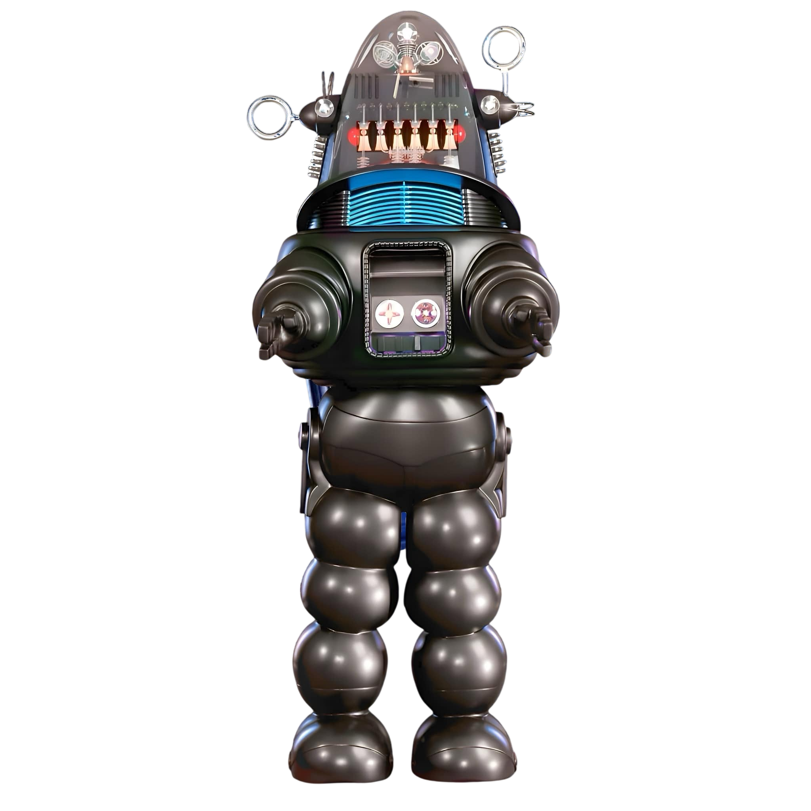

# Robby Control Console

A web-based control console inspired by **Robby the Robot** from the classic 1956 science fiction film *Forbidden Planet*.

This project recreates the look and feel of a vintage 1950s robotic control station, combining retro instrumentation, illuminated controls, animated knobs, audio playback, and future ESP32 integration into a single interactive dashboard.



---

## Features

### Current Features

* Vintage-inspired control console interface
* Animated control knobs with angle readouts
* Center-reset controls
* Illuminated hot-toggle buttons
* Voltage meter display
* Signal meter display
* Power control switch
* Connect control switch
* Audio repertoire panel
* Scrollable track library
* Robby display area
* Speaker grill and serial plate styling
* Responsive web-based design

---

## Project Structure

```text
Robby-Control-Console
│
├── index.html
├── README.md
│
├── images
│   ├── Robby-NO-background.png
│   ├── Knob Without Line.png
│   ├── Button-Narrow-ON.png
│   ├── Button-Narrow-OFF.png
│   ├── Power-ON.png
│   ├── Power-OFF.png
│   ├── Connect-ON.png
│   ├── Connect-OFF.png
│   ├── Voltage-NO-Needle.png
│   └── Signal-NO-Needle.png
│
├── audio
│
├── video
│
├── css
│
├── js
│
└── data
```

---

## Audio Library

Audio files are stored in the `/audio` folder.

Supported formats:

* MP3
* WAV

Example:

```text
audio/
├── Admit-No-One.mp3
├── Again.mp3
├── Analyzing.wav
├── Fusal-Oil.mp3
├── Oil-Job.mp3
└── Radiation-Proof.mp3
```

Future releases will support automatic playlist generation from audio metadata.

---

## Planned Features

### Version 2.5

* Integrated audio player
* Playlist management
* Track search

### Version 2.6

* Animated meter needles
* Real-time meter updates

### Version 2.7

* ESP32 Bluetooth integration
* Remote control communications
* Status telemetry

### Version 3.0

* Full Robby remote control console
* Audio and video playback
* Robotic motion control
* Live diagnostics display

---

## Inspiration

This project is inspired by:

* Robby the Robot
* Forbidden Planet (1956)
* Mid-century industrial control panels
* Atomic Age science fiction
* Vintage analog instrumentation

---

## Development

This project is actively under development.

Feedback, ideas, and contributions are welcome.

---

## Credits

Concept, design, artwork integration, and development:

**Don Lockard**

West Tennessee, USA

---

## Version

Current Development Version:

**Robby Control Console V2.4.1**
